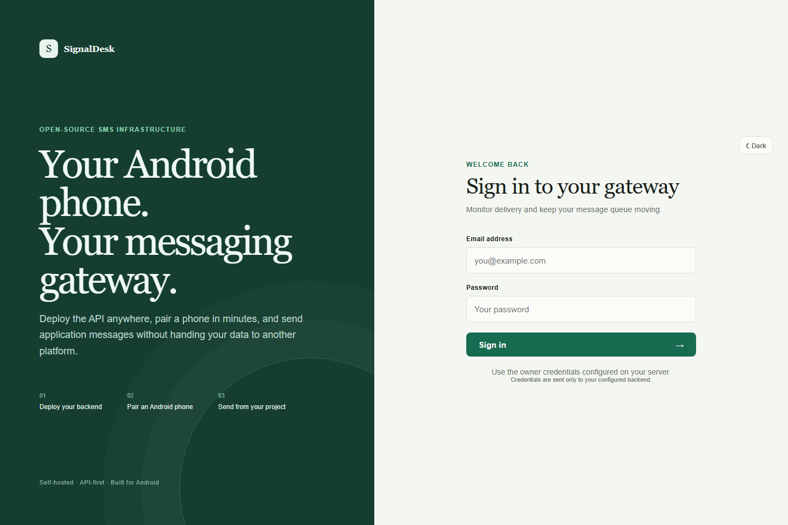
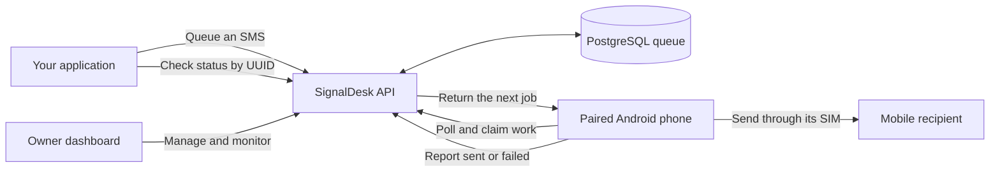

<div align="center">

# SignalDesk

### Turn an Android phone into a private, self-hosted SMS gateway.

Queue messages through a clean API, send them through your own SIM, and follow every handoff from one owner dashboard.

<p>
  
  
  
  
  <a href="LICENSE"></a>
</p>

[Quick start](#quick-start) · [Install Android](#install-and-pair-android) · [Use the API](#send-from-your-project) · [Deployment](docs/DEPLOYMENT.md) · [Security](docs/SECURITY.md)

</div>

<p align="center">
  
</p>

<p align="center"><em>A calm, responsive owner workspace with polished light and dark modes.</em></p>

## Why SignalDesk?

SignalDesk is built for one person or organization that wants to operate its own SMS gateway without relying on a hosted messaging platform. The Express API queues work in PostgreSQL, and one or more paired Android phones pull jobs and send them through their SIM cards.

| | Capability | What it gives you |
| --- | --- | --- |
| 📱 | **Native Android delivery** | Send SMS from a real SIM using the included native-enabled Expo app. |
| ⚖️ | **Balanced phone fleet** | Share queued work across available connected devices. |
| 🔎 | **Full delivery timeline** | See when a message was requested, claimed, started, sent, or failed. |
| 🔑 | **Multiple API keys** | Create separate credentials and review request and message usage per key. |
| ⏸️ | **Device control** | Take a phone offline without unpairing it, then bring it back when ready. |
| ◐ | **Focused owner dashboard** | Login-only access, first-login password change, analytics, history, and light/dark themes. |

## How it works



The backend does not push directly to the phone. The Android app checks in, claims the next available job, sends it, and reports the outcome. This pull model also lets the phone restore unsent results after reconnecting.

## Project layout

```text
signaldesk/
├── backend/     Express API, Prisma, and PostgreSQL migrations
├── frontend/    React and Vite owner dashboard
├── mobile/      Expo and React Native Android sender
├── docs/        Deployment, Android, API, and security guides
└── docker-compose.yml
```

## Quick start

### Requirements

For the recommended local setup you need:

- **Docker Desktop** for PostgreSQL and the backend
- **Node.js 20+** for the dashboard
- An **Android phone with a SIM** for sending real messages

Without Docker, install Node.js 20+ and PostgreSQL 14+ and run the backend manually.

### 1. Configure the backend

Copy the root environment example:

```bash
# macOS or Linux
cp .env.example .env
```

```powershell
# Windows PowerShell
Copy-Item .env.example .env
```

Edit `.env` and replace every example secret. `ADMIN_PASSWORD` must contain at least 12 characters.

```dotenv
POSTGRES_PASSWORD=use-a-strong-database-password
JWT_SECRET=generate-a-long-random-value
ADMIN_EMAIL=owner@example.com
ADMIN_PASSWORD=choose-a-temporary-password
CORS_ORIGIN=http://localhost:5173
PORT=6700
```

> [!IMPORTANT]
> The configured owner is created only on the first backend startup. You will be required to replace the temporary password on first login; later restarts do not reset it.

Start PostgreSQL and the API:

```bash
docker compose up --build -d
```

Confirm that the backend is ready:

```bash
curl http://localhost:6700/health
```

Expected response:

```json
{ "status": "ok" }
```

### 2. Start the dashboard

```bash
cd frontend
npm install
```

Copy `frontend/.env.example` to `frontend/.env`, then make sure it contains:

```dotenv
VITE_API_URL=http://localhost:6700
```

Start the dashboard:

```bash
npm run dev
```

Open [http://localhost:5173](http://localhost:5173), sign in with `ADMIN_EMAIL` and `ADMIN_PASSWORD`, and choose your permanent password.

## Install and pair Android

### Use the ready-to-install APK

[](https://expo.dev/accounts/natnaelfikre/projects/sms-gateway/builds/47e2635c-ba6b-4f92-ab72-aeb35ddab681)

[Watch the short APK installation walkthrough](https://www.youtube.com/shorts/N90_Buk_6O0), then:

1. Download the APK on the Android phone and allow installation from that source.
2. Let Google Play Protect scan the app; do not disable Play Protect.
3. If Android blocks SMS access, open **App info → More options → Allow restricted settings**, then grant the SMS permission.
4. In the dashboard, open **Devices** and copy the backend URL and seven-character pairing code.
5. Enter both values in the Android app and keep the persistent sender service enabled.

> [!WARNING]
> A physical phone cannot reach your computer through `localhost`. During LAN testing, use a reachable address such as `http://192.168.1.20:6700`. For a deployed gateway, use its public HTTPS backend URL.

See the full [Android, permissions, EAS, and SMS-limit guide](docs/ANDROID.md) for manufacturer-specific permission help and the one-time ADB limit change.

### Compile a development app locally

This project uses native Kotlin SMS modules, so Expo Go is not sufficient.

```bash
cd mobile
npm install
npm run android
```

This path requires Android Studio or Android SDK Platform Tools, USB debugging, and a connected phone. Metro must remain available while using a development build.

### Build a shareable APK with EAS

```bash
cd mobile
npm install
npx eas-cli@latest login
npx eas-cli@latest build --platform android --profile preview
```

The `preview` profile creates a standalone APK with its JavaScript bundle included, so recipients do not need Metro, USB, or your development computer.

## Send from your project

Open **API access** in the dashboard, create a key, and copy it when revealed. SignalDesk stores only the key hash afterward.

### Queue an SMS

```bash
curl -X POST https://sms.example.com/api/v1/sms/send \
  -H "X-API-Key: sms_your_key" \
  -H "Content-Type: application/json" \
  -d '{"phone_number":"+251900000000","message_text":"Your order is ready."}'
```

An HTTP `201` response means **queued**, not yet sent:

```json
{
  "id": "7b976a64-bb62-4c5f-8fa2-d63282113481",
  "status": "pending",
  "status_url": "/api/v1/sms/7b976a64-bb62-4c5f-8fa2-d63282113481"
}
```

### Check the final status

```bash
curl https://sms.example.com/api/v1/sms/7b976a64-bb62-4c5f-8fa2-d63282113481 \
  -H "X-API-Key: sms_your_key"
```

Poll the returned UUID every 2–5 seconds until `terminal` is `true`. A terminal message is either `sent` or `failed`; submitting the POST request again would create another message.

Read the [complete HTTP API guide](docs/API.md) for response fields, error codes, and a JavaScript polling example.

## Deployment and operations

| Guide | Covers |
| --- | --- |
| [Deployment](docs/DEPLOYMENT.md) | Environment variables, HTTPS reverse proxies, dashboard builds, and upgrades |
| [Android and SMS limit](docs/ANDROID.md) | APK installation, restricted SMS permission, pairing, and the one-time Android SMS-limit setup |
| [HTTP API](docs/API.md) | Authentication, sending, UUID status checks, and lifecycle fields |
| [Production security](docs/SECURITY.md) | Secrets, network exposure, backups, key handling, and responsible operation |

For a production dashboard, set `VITE_API_URL` to the public HTTPS backend URL **before** running `npm run build`. Add the dashboard's exact origin to `CORS_ORIGIN`; multiple origins can be comma-separated.

## Test before contributing

Install dependencies in `backend`, `frontend`, and `mobile`, then run from the repository root:

```bash
npm test
npm run build
```

Contributions and focused bug reports are welcome. Please describe the device, Android version, deployment method, and relevant lifecycle event when reporting a sending problem—but remove phone numbers, message text, secrets, and API keys from logs.

## Privacy and responsible use

SignalDesk does not require a hosted SignalDesk service. Dashboard accounts, API keys, recipient numbers, message content, and delivery history are stored in the PostgreSQL instance you operate. Messages leave the system through the paired phone's SIM and mobile carrier.

You are responsible for recipient consent, carrier terms, opt-out handling, rate limits, backups, and applicable law. Do not use Android or ADB settings to evade platform, carrier, consent, or legal safeguards.

## License

SignalDesk is available under the [MIT License](LICENSE).
